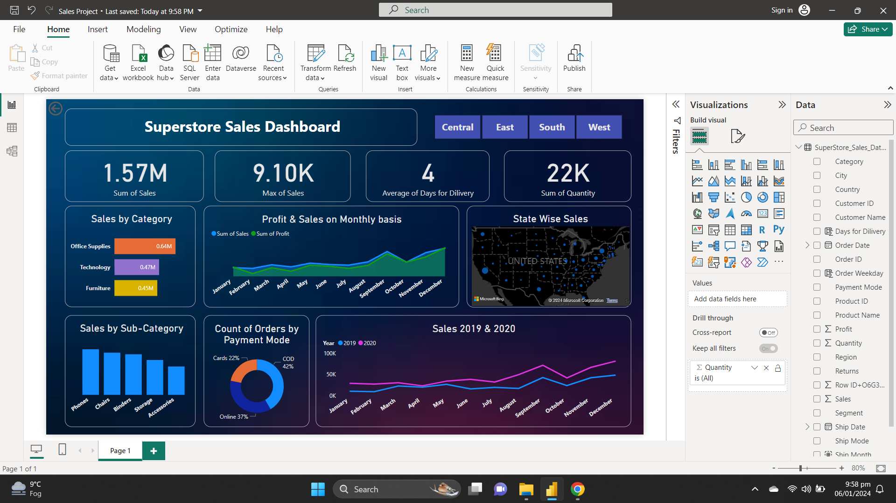

# Superstore Sales Dashboard (Power BI)

Welcome to the **Superstore Sales Dashboard** project! This dashboard is built using **Power BI** and is based on a sample sales dataset. It provides interactive and insightful visualizations to analyze sales performance across regions, categories, and time periods.



## Project Contents

- `Sales Project.pbix` – Power BI project file.
- `SuperStore_Sales_Dataset.csv` – Raw sales data used to create the dashboard.
- `images.png` – Custom background image used in the Power BI dashboard.

---

## Dashboard Features

- **KPI Tiles**: 
  - Total Sales: 1.57M
  - Maximum Sales: 9.10K
  - Average Delivery Days: 4
  - Total Quantity Sold: 22K

- **Charts & Visuals**:
  - **Sales by Category & Sub-Category**
  - **Profit & Sales by Month**
  - **Sales by State (Map Visualization)**
  - **Order Count by Payment Mode**
  - **Sales Comparison (2019 vs 2020)**

- **Region Filter**: Central, East, South and West buttons for regional filtering.

---

## How to Use
Clone this repository:
   ```bash
   git clone https://github.com/IamHamzaAziz/sales-dashboard-powerbi.git
