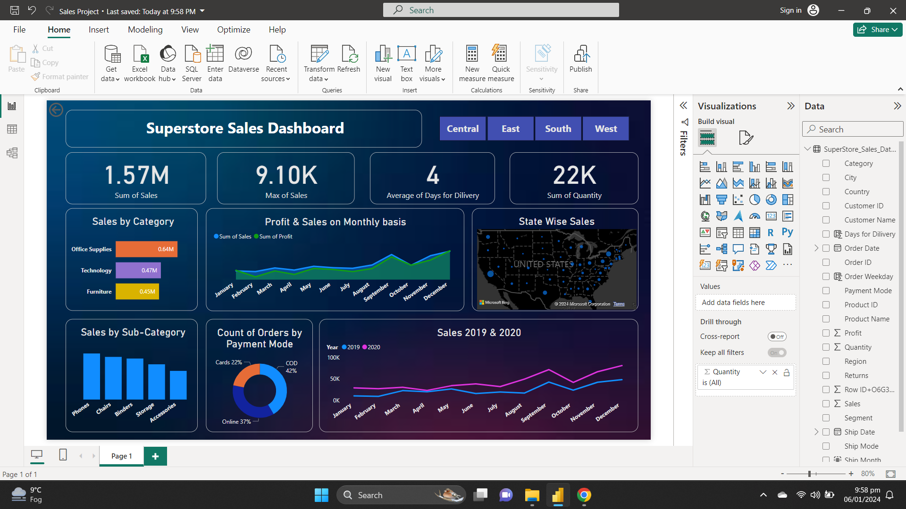

# SalesDashboardPowerBI
This project is a dashboard for a US based superstore created using Microsoft's Power BI.
 The visuals help a great deal in many ways such as determining which state has most sales, which category of products had generated most sales or which payment method was most widely used.
  Below is the screenshot of the dashboard

